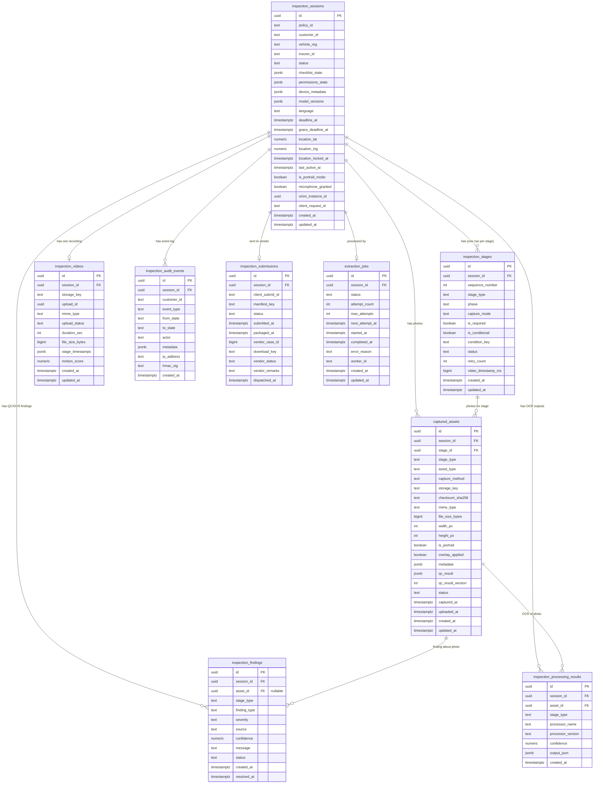

# Database schema — `vehicle_inspection`

The dashboard reads 9 tables in the `public` schema. The real DDL ships inside
`data/01-vehicle_inspection.sql`, which is not in the repo (`.gitignore` excludes
`data/*.sql`). This document is reconstructed from the code that reads and writes
those tables (`app/seed-demo.mjs`, `app/lib/*.mjs`). Column names are exact;
column types are inferred from the values written, so check them against the
snapshot once you have it.

## Relationship diagram

Open this file in Markdown preview (`Cmd+Shift+V`) to see the diagram.



## How the tables connect

`inspection_sessions` is the centre: one row per inspection case, and every other
table points at it through `session_id`.

| From | To | Cardinality | Notes |
|---|---|---|---|
| `inspection_stages.session_id` | `inspection_sessions.id` | many → one | One row per stage in the flow (13 today), ordered by `sequence_number`. Deleting the session removes them. |
| `inspection_videos.session_id` | `inspection_sessions.id` | zero/one → one | Exists only once recording starts. |
| `captured_assets.session_id` | `inspection_sessions.id` | many → one | Deleting the session removes them. |
| `captured_assets.stage_id` | `inspection_stages.id` | many → one | The extracted frame plus any retakes for that stage. |
| `inspection_findings.session_id` | `inspection_sessions.id` | many → one | |
| `inspection_findings.asset_id` | `captured_assets.id` | many → zero/one | `NULL` for `MISSING_STAGE`, where there is no photo. No cascade: delete findings before assets. |
| `inspection_processing_results.session_id` | `inspection_sessions.id` | many → one | |
| `inspection_processing_results.asset_id` | `captured_assets.id` | many → one | No cascade: delete these before assets. |
| `inspection_audit_events.session_id` | `inspection_sessions.id` | many → one | Append-only state-change log. |
| `inspection_submissions.session_id` | `inspection_sessions.id` | zero/one → one | Created when the case is sent to the vendor. |
| `extraction_jobs.session_id` | `inspection_sessions.id` | zero/one → one | Background job that pulls frames out of the video. |

`stage_type` is also duplicated as a plain text column on stages, assets, findings,
processing results and inside `inspection_videos.stage_timestamps`. The dashboard
joins and groups on it directly rather than going through `inspection_stages`.

## Table-by-table reference

Key: **PK** primary key, **FK** foreign key. All timestamps are `timestamptz`
stored in UTC; the dashboard converts them to IST (`Asia/Kolkata`) for display
and date filters.

### 1. `inspection_sessions` — one row per inspection case

The case itself: who the customer is, which vehicle and policy it covers, where
it is in its lifecycle, and when it expires. Every other table hangs off this one.

| Column | Type | Key | Description |
|---|---|---|---|
| `id` | uuid | PK | Unique ID of the inspection case. |
| `policy_id` | text | | Insurance policy number the inspection is for, e.g. `UIIC/MTR/2026/310029`. |
| `customer_id` | text | | ID of the customer doing the self-inspection, e.g. `CUST480117`. |
| `vehicle_reg` | text | | Vehicle registration number (number plate), e.g. `MH12AB1234`. |
| `insurer_id` | text | | Insurance company: `united_india`, `new_india`, `oriental`, `national`. |
| `status` | text | | Where the case is now: `SETUP` (link opened), `READY` (permissions granted), `RECORDING` (video in progress), `REVIEW_READY` (photos extracted, awaiting review), `SUBMITTED` (sent to vendor), `ABORTED` (customer quit), `EXPIRED` (deadline passed), `EXTRACTION_FAILED`, `SUBMISSION_FAILED`. The dashboard groups these into buckets (not started, in progress, and so on). |
| `checklist_state` | jsonb | | Customer's pre-inspection answers: fuel type, whether the car is bi-fuel (CNG/LPG, which adds two extra stages), and whether there was a previous policy. |
| `permissions_state` | jsonb | | Which phone permissions were granted: camera, microphone, location. |
| `device_metadata` | jsonb | | Customer's phone: browser user-agent and screen size. |
| `model_versions` | jsonb | | Versions of the AI models (QC, OCR, stage classifier) that processed this case. Empty until recording starts. |
| `language` | text | | UI language chosen by the customer: `en`, `hi`, `mr`. |
| `deadline_at` | timestamptz | | When the case expires; 72 hours after creation. |
| `grace_deadline_at` | timestamptz | | 10 minutes before `deadline_at`; cut-off used to warn or wrap up before expiry. |
| `location_lat` | numeric | | Latitude of the phone when location was locked, to confirm where the inspection happened. |
| `location_lng` | numeric | | Longitude, as above. |
| `location_locked_at` | timestamptz | | When the location was captured. |
| `last_active_at` | timestamptz | | Last time the customer did something. Used to spot stalled cases and to check whether capture finished on day one. |
| `is_portrait_mode` | boolean | | Whether the video was recorded holding the phone upright. |
| `microphone_granted` | boolean | | Shortcut copy of the microphone permission. |
| `orion_instance_id` | uuid | | ID of the backend workflow instance that runs this case. |
| `client_request_id` | text | | Idempotency key from the client that created the case. Demo rows use `demo-seed-<id>`. |
| `created_at` | timestamptz | | When the case was created (the inspection link was issued). The main date the dashboard filters on. |
| `updated_at` | timestamptz | | Last time the row changed. |

### 2. `inspection_stages` — the checklist of shots for each case

One row per required or optional shot in the capture flow. Each case gets all 13
stages up front with status `PENDING`, and they are updated as the customer
records and the AI checks the photos.

| Column | Type | Key | Description |
|---|---|---|---|
| `id` | uuid | PK | Unique ID of this stage for this case. |
| `session_id` | uuid | FK → `inspection_sessions.id` | The case it belongs to. |
| `sequence_number` | int | | Position in the capture order (1 = first). |
| `stage_type` | text | | Which shot: `RC_DOCUMENT` (registration certificate), `WINDSHIELD_INSIDE`, `INTERIOR_DASHBOARD` (odometer), `CHASSIS_NUMBER`, `ENGINE_BAY`, `FRONT_VIEW`, `UNDER_FRONT`, `RIGHT_SIDE`, `REAR_VIEW`, `LEFT_SIDE`, `DICKY_BOOT` (boot), `BI_FUEL_TANK`, `GAS_KIT_NUMBER`. Older rows may hold retired stages (`*_DIAGONAL`, `ODOMETER`, `PREVIOUS_DAMAGE`, `VRN`), which the dashboard hides. |
| `phase` | text | | `A` = documents and interior, `B` = exterior walk-around. |
| `capture_mode` | text | | How the photo is obtained. `EXTRACTED` = pulled from the video as a frame. |
| `is_required` | boolean | | Whether the case can't pass without this shot. |
| `is_conditional` | boolean | | Whether the stage only applies in some cases. |
| `condition_key` | text | | The condition, when there is one: `BI_FUEL_ONLY` (CNG/LPG cars only). |
| `status` | text | | `PENDING` (not checked yet), `QC_PASS` (usable photo), `QC_FAIL` (missing or unreadable). |
| `retry_count` | int | | How many times the customer retook this shot. Feeds the retake metrics. |
| `video_timestamp_ms` | bigint | | Milliseconds into the video when the customer marked this stage. |
| `created_at` | timestamptz | | When the stage row was created. |
| `updated_at` | timestamptz | | Last change, e.g. when QC finished. |

### 3. `inspection_videos` — the walk-around recording

One row per case once recording starts. The photos are extracted from this video.

| Column | Type | Key | Description |
|---|---|---|---|
| `id` | uuid | PK | Unique ID of the video. |
| `session_id` | uuid | FK → `inspection_sessions.id` | The case it belongs to (one video per case). |
| `storage_key` | text | | Path of the video file in object storage, e.g. `inspections/<id>/video.mp4`. |
| `upload_id` | uuid | | ID of the chunked (multipart) upload, used to resume it. |
| `mime_type` | text | | File format, `video/mp4`. |
| `upload_status` | text | | `IN_PROGRESS` (still uploading), `COMPLETE`, `FAILED`. A failure counts as a technical failure on the dashboard. |
| `duration_sec` | int | | Video length in seconds. Filled once the upload completes. |
| `file_size_bytes` | bigint | | Video size in bytes. Filled once the upload completes. |
| `stage_timestamps` | jsonb | | Ordered list of stages the customer tapped during recording, with the time of each. Source for stage dwell time (how long people spend per shot) and for where people drop off. |
| `motion_score` | numeric | | 0–1 measure of how much the camera moved; higher means shakier video. |
| `created_at` | timestamptz | | When recording began. |
| `updated_at` | timestamptz | | Last upload progress or status change. |

### 4. `captured_assets` — the photos

Every photo on the case: frames the AI extracted from the video, plus retakes the
customer shot directly.

| Column | Type | Key | Description |
|---|---|---|---|
| `id` | uuid | PK | Unique ID of the photo. |
| `session_id` | uuid | FK → `inspection_sessions.id` | The case it belongs to. |
| `stage_id` | uuid | FK → `inspection_stages.id` | The stage this photo is for. |
| `stage_type` | text | | Copy of the stage name, so queries don't need a join. |
| `asset_type` | text | | Kind of file, `PHOTO`. |
| `capture_method` | text | | `EXTRACTED` (frame taken from the video) or `RETAKE` (customer reshot it). |
| `storage_key` | text | | Path of the image in object storage. |
| `checksum_sha256` | text | | SHA-256 fingerprint of the file, to prove it hasn't been altered. |
| `mime_type` | text | | File format, `image/jpeg`. |
| `file_size_bytes` | bigint | | Image size in bytes. |
| `width_px` | int | | Image width in pixels. |
| `height_px` | int | | Image height in pixels. |
| `is_portrait` | boolean | | Whether the image is taller than it is wide. |
| `overlay_applied` | boolean | | Whether the on-screen framing guide was shown when the photo was taken. |
| `metadata` | jsonb | | Where it came from (`video` or `camera`) and the video position of the frame. |
| `qc_result` | jsonb | | AI quality check output: `confidence` (0–1) and `laplacian_score` (sharpness; low means blurry). |
| `qc_result_version` | int | | Version of the QC output format. |
| `status` | text | | QC verdict: `PASSED`, `WARNING` (usable but not great), `FAILED`. |
| `captured_at` | timestamptz | | When the photo was taken or the frame was recorded. |
| `uploaded_at` | timestamptz | | When it reached storage. |
| `created_at` | timestamptz | | When the row was created. |
| `updated_at` | timestamptz | | Last change. |

### 5. `inspection_findings` — problems the AI flagged

Each issue found by QC or OCR. `BLOCKING` findings stop the case from passing.

| Column | Type | Key | Description |
|---|---|---|---|
| `id` | uuid | PK | Unique ID of the finding. |
| `session_id` | uuid | FK → `inspection_sessions.id` | The case it belongs to. |
| `asset_id` | uuid | FK → `captured_assets.id` | The photo it is about. `NULL` when the problem is that no photo exists. |
| `stage_type` | text | | Which stage the problem is in. |
| `finding_type` | text | | `MISSING_STAGE` (no usable frame for a required shot), `NOT_READABLE` (OCR couldn't read the text), `BLURRY`, `OBSTRUCTED` (something blocking the view). |
| `severity` | text | | `BLOCKING` (case can't pass) or `WARNING` (worth noting). |
| `source` | text | | Which system raised it: `QC_WORKER` (image quality) or `OCR` (text reading). |
| `confidence` | numeric | | Model confidence, 0–1. `NULL` for missing stages. |
| `message` | text | | Message shown to the customer, e.g. "The image is blurry. Hold the camera steady and retake." |
| `status` | text | | `OPEN` (unhandled), `ACKNOWLEDGED` (reviewer accepted it), `RESOLVED` (fixed, e.g. by a retake). |
| `created_at` | timestamptz | | When it was raised. |
| `resolved_at` | timestamptz | | When it was resolved, if it was. |

### 6. `inspection_processing_results` — what OCR read from the photos

Text pulled from document and number photos by the OCR models.

| Column | Type | Key | Description |
|---|---|---|---|
| `id` | uuid | PK | Unique ID of the result. |
| `session_id` | uuid | FK → `inspection_sessions.id` | The case it belongs to. |
| `asset_id` | uuid | FK → `captured_assets.id` | The photo that was read. |
| `stage_type` | text | | Which stage the photo is from. |
| `processor_name` | text | | Which OCR ran: `ocr_rc` (registration certificate), `ocr_odometer` (km reading), `ocr_plate` (number plate), `ocr_chassis` (VIN), `ocr_gas_kit` (CNG kit number). |
| `processor_version` | text | | Version of that OCR model, e.g. `v1`. |
| `confidence` | numeric | | How sure the OCR is, 0–1. |
| `output_json` | jsonb | | The extracted values, e.g. plate number, chassis number, odometer km, raw text. |
| `created_at` | timestamptz | | When OCR ran. |

### 7. `inspection_audit_events` — the event log

Append-only history of everything that happened to a case, by the customer, the
system or a background worker. Powers the case timeline and several funnel metrics
(for example, "started recording" counts `recording_started` events).

| Column | Type | Key | Description |
|---|---|---|---|
| `id` | uuid | PK | Unique ID of the event. |
| `session_id` | uuid | FK → `inspection_sessions.id` | The case it belongs to. |
| `customer_id` | text | | Customer on the case (copied for audit). |
| `event_type` | text | | What happened: `permission_granted`, `permission_denied`, `recording_started`, `recording_complete`, `upload_failed`, `session_aborted`, `extraction_started`, `extraction_completed`, `extraction_failed`, `submission_dispatched`, `submission_failed`, `vendor_verdict_received`, `reminder_sent`, `session_expired`. |
| `from_state` | text | | Case status before the event, when it changed the status. |
| `to_state` | text | | Case status after the event. |
| `actor` | text | | Who caused it: `customer`, `system`, `worker`. |
| `metadata` | jsonb | | Event details, e.g. abort reason, error message, reminder channel (SMS/WhatsApp/push), vendor verdict. |
| `ip_address` | text | | Customer's IP address, for customer actions only. |
| `hmac_sig` | text | | Cryptographic signature of the event so tampering can be detected. |
| `created_at` | timestamptz | | When it happened. |

### 8. `inspection_submissions` — hand-off to the inspection vendor

Created when a finished case is packaged and sent to the external vendor, who
approves or rejects it.

| Column | Type | Key | Description |
|---|---|---|---|
| `id` | uuid | PK | Unique ID of the submission. |
| `session_id` | uuid | FK → `inspection_sessions.id` | The case that was submitted (one per case). |
| `client_submit_id` | text | | Idempotency key so the same case isn't submitted twice. |
| `manifest_key` | text | | Path of the manifest file listing everything in the package. |
| `status` | text | | Our side of the hand-off: `DISPATCHED` (sent) or `FAILED`. |
| `submitted_at` | timestamptz | | When submission was triggered. |
| `packaged_at` | timestamptz | | When the evidence package was built. |
| `vendor_case_id` | bigint | | The vendor's reference number for this case. |
| `download_key` | text | | Path of the evidence ZIP the vendor downloads. |
| `vendor_status` | text | | Vendor's workflow status: `IN_REVIEW`, `QC_APPROVED`, `QC_REJECTED`, `PHOTOS_ON_HOLD`. |
| `vendor_remarks` | text | | Vendor's final verdict: `APPROVED`, `REJECTED`, `PHOTOS_ON_HOLD`, or empty while in review. `REJECTED` drives the "rejected" filter on the dashboard. |
| `dispatched_at` | timestamptz | | When the vendor confirmed receipt. |

### 9. `extraction_jobs` — background photo extraction

The queued job that pulls stage photos out of the video after upload, then runs
QC and OCR on them.

| Column | Type | Key | Description |
|---|---|---|---|
| `id` | uuid | PK | Unique ID of the job. |
| `session_id` | uuid | FK → `inspection_sessions.id` | The case it processes. |
| `status` | text | | `COMPLETED` or `FAILED`. |
| `attempt_count` | int | | How many times it has been tried. |
| `max_attempts` | int | | Retry limit (3) before it is marked failed. |
| `next_attempt_at` | timestamptz | | When the next try is scheduled. |
| `started_at` | timestamptz | | When processing began. |
| `completed_at` | timestamptz | | When it finished or finally failed. |
| `error_reason` | text | | Why it failed, e.g. "frame extraction timed out after 3 attempts". |
| `worker_id` | text | | Which worker machine ran it, e.g. `qc-worker-2`. |
| `created_at` | timestamptz | | When the job was queued. |
| `updated_at` | timestamptz | | Last change. |

## JSON column shapes

```jsonc
// inspection_sessions.checklist_state
{ "fuel_type": "PETROL_CNG", "is_bi_fuel": true, "has_previous_policy": false }
// inspection_sessions.permissions_state
{ "camera_granted": true, "location_granted": true, "microphone_granted": true }
// inspection_sessions.model_versions
{ "qc_model": "qc-yolo-1.4.2", "ocr_model": "ocr-2.3.0", "stage_classifier": "stagecls-0.9.1" }
// inspection_videos.stage_timestamps — one entry per stage the customer marked, in order
[{ "stage_type": "RC_DOCUMENT", "captured_at": "2026-09-20T05:12:31Z", "video_timestamp_ms": 31250 }]
// captured_assets.qc_result
{ "confidence": 0.91, "laplacian_score": 412.5 }
// inspection_processing_results.output_json (ocr_plate example)
{ "vrn": "MH12AB1234", "raw_text": "IND MH12AB1234", "confidence": 0.95 }
```
